# Velok-Fabric-SV-1.20.1

## Intento de indice

- [En caso de no tener Java](#en-caso-de-no-tener-java)
- [En caso de tener Java](#en-caso-de-tener-java)
- [En caso de no tener idea de q version de java tienen o de que quieran saber siquiera si tienen java](#y-si-no-se-si-tengo-java-o-no-se-que-version-de-java-tengo?)
- [En caso de tener Java pero no es java 21, o es superior a java 21](#en-caso-de-tener-java-pero-no-es-java-21-o-es-superior-a-java-21)
- [Para configurar la ram en el Legacy Launcher](#para-configurar-la-ram-en-el-legacy-launcher)
- [En caso de no tener Launcher de Minecraft ya](#en-caso-de-no-tener-launcher-de-minecraft-ya)
- [En caso de ya tener Launcher de Minecraft pero no tener fabric](#en-caso-de-ya-tener-launcher-de-minecraft-pero-no-tener-fabric)
- [Instalacion del pack de mods](#instalacion-del-pack-de-mods)

---

Intento de explicacion de como instalar minecraft y el pack de mods?  

Si tienen el launcher premium de minecraft leanse como instalar fabric

---

# En caso de no tener Java

Si no tienen java esta chistoso pq mc no sirve sin java asi q aca en el repo tambien subi un instalador de java 21 q es lo q usa nuestro fabric y nuestro pack de mods

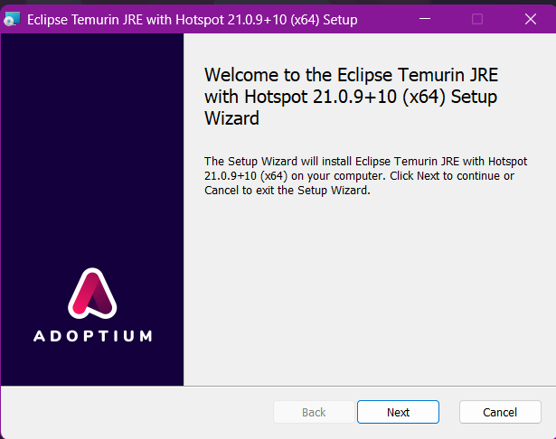

Es un asistente de instalacion normal, denle a siguiente o a next todo el rato y ya hasta q acabe

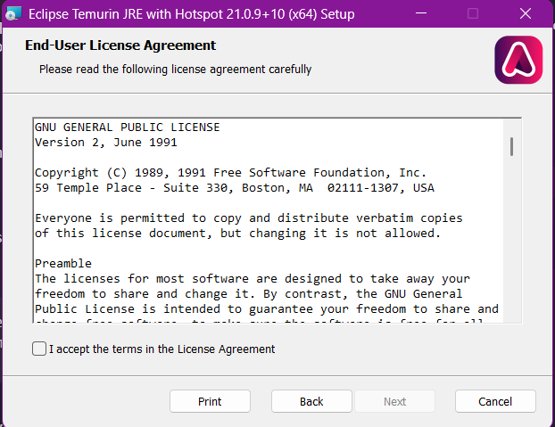

lo unico q no los va a dejar continuar seria la segunda pestaña del instalador q es donde tienen q aceptar la licencia, luego de eso ahi si le dan next o siguiente a todo hasta q les diga instalar y ya

# En caso de tener java

Literalmente si tienen java pero no es el 21 tienen q instalar el java 21 asi q lean q psa si no tienen java, y si saben q tienen java pero no saben q version es leanse q psa si no se si tengo java mas abajo

# Y si no se si tengo java o no se que version de java tengo? 

si quieren saber q version de java tienen pq saben q si tienen java pero no se acuerdan de q version instalaron o sencillamente quieren saber si tienen java o no hagan esto:

osea esto 

presionen las teclas windows + r al mismo tiempo

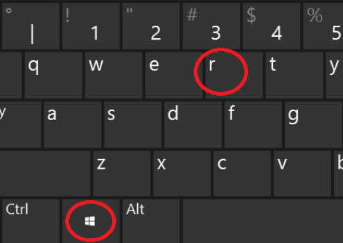

se les va a abrir un menu q ni la menor idea de como se llama

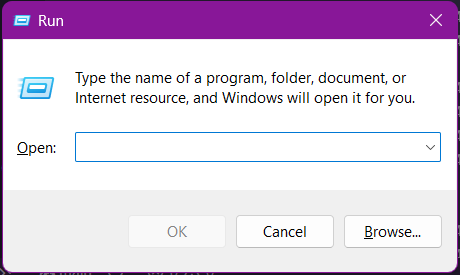

ahi escriben cmd, literalmente cmd, luego le dan a la tecla enter

osea, no c, hay muchos tipos de teclas enter

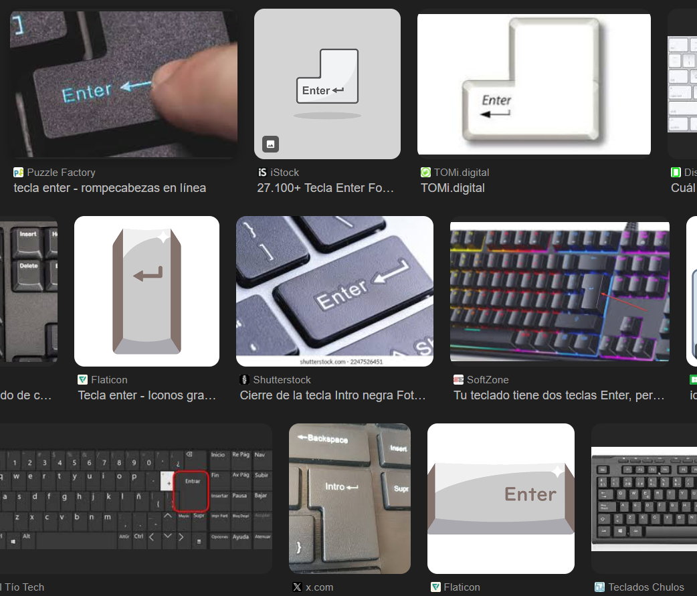

y les va a abrir el cmd

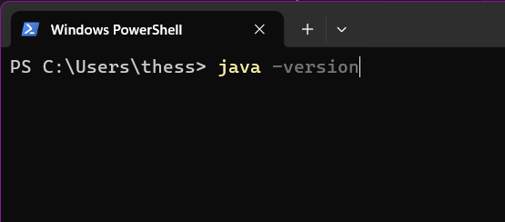

y ahi solo escriben java -version y ya, les sale la version de java

pero si no tienen java instalen el java, osea, leanse q onda si no tienen java

Por desgracia para mi recorde luego de escribir q onda si tienen java inferior al 21 q tengo q explicar como seleccionar la version de java en el minecraft

y por desgracia para el q este leyendo esto si no usan el Legacy launcher pues f, resuelvanse pq no se como es su config

pero si usan el legacy launcher es asi

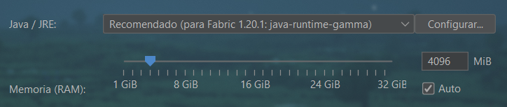

se selecciona la version literalmente mas arriba de donde se configura la ram

solo denle al select q esta a la izquierda del boton configurar

y ahi les deberia salir la version creo

creo

# En caso de tener Java pero no es java 21, o es superior a java 21

Si se preguntan como saber q version de java tienen solo lean En caso de tener java literalmente aca arriba, aunque bueno tambien leanlo o vayan al final para poder arreglar el q tengan una version inferior a java 21... aunque tambien podria ser superior, voy a editar el titulo de esta vaina

y si tienen una version superior a java 21 desde un principio pues no tienen q hacer nada, felicidades

# Para configurar la ram en el Legacy Launcher

Independientemente de q Launcher usen, tienen q configurar la ram con la q van a abrir el juego, por q por defecto creo q usa 1gb y eso es un chiste para jugar con mods. Y sin ellos la verdad

En el Legacy Launcher para cambiar la cantidad de ram que se usa dentro del juego tienen q darle al boton abajo a la derecha q tienen tres lineas y darle a preferencias

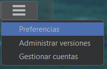

Y dentro de preferencias bajan un poco y ahi esta para configurar la ram

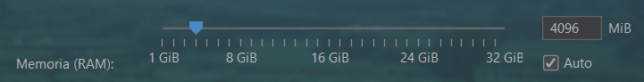

A mira, salen 4gb por defecto no sabia. Bueno el chiste es q tienen q probar como les corre, si quieren con eso por defecto y si les va lag lo cambian y le ponen mas y ya no c  

# En caso de no tener Launcher de Minecraft ya

- Primero dependiendo de q launcher se use, ( yo recomiendo el Legacy Launcher o al menos eso voy a usar para explicar esto) se tiene q instalar el Fabric sea desde el Launcher si lo permite o directamente desde el instalador de fabric

- Aca en la carpeta resources subi, tanto el instalador del Legacy Launcher, como el Instalador del Fabric

- Si se usa el Legacy desde un principio se facilita al menos la instalacion y la configuracion de la version del fabric

Si instalan el Legacy lo primero q vean cuando lo abran sera esto

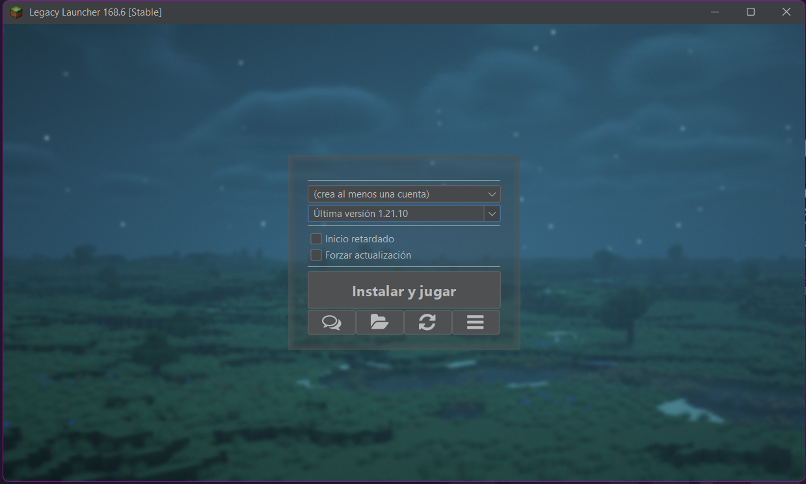 

Se les va a pedir q creen una cuenta

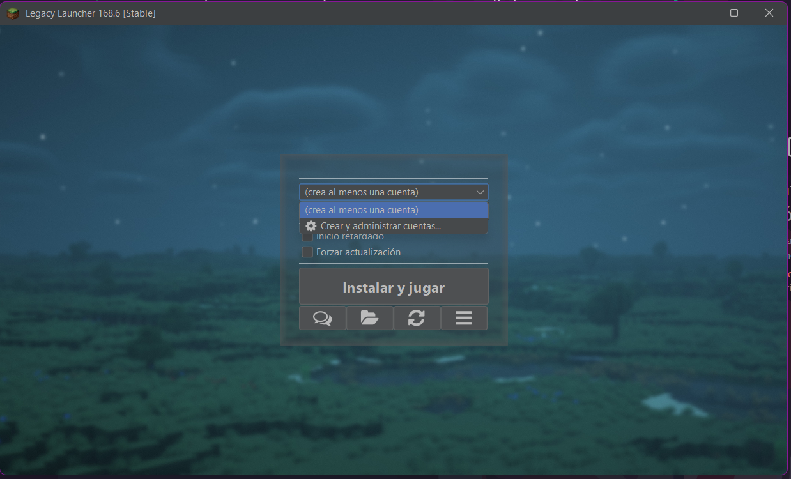

Y cuando entren a la seccion de administracion o creacion de cuentas

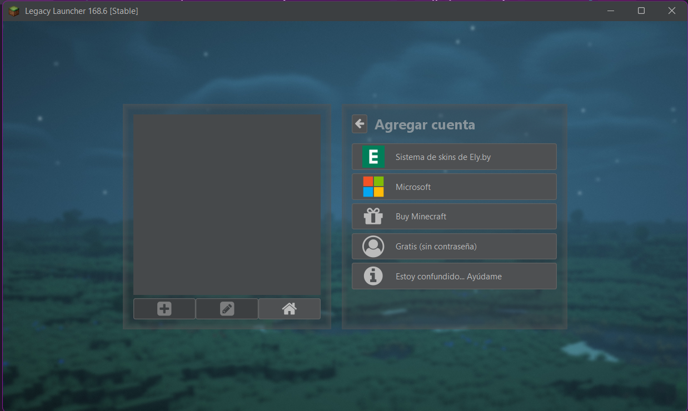

Van a poder elegir:

- Si usar una cuenta de minecraft en caso de q la tengan y quieran usar este launcher
- O usar una cuenta gratis, q seria una cuenta no premium y el proposito de este launcher  

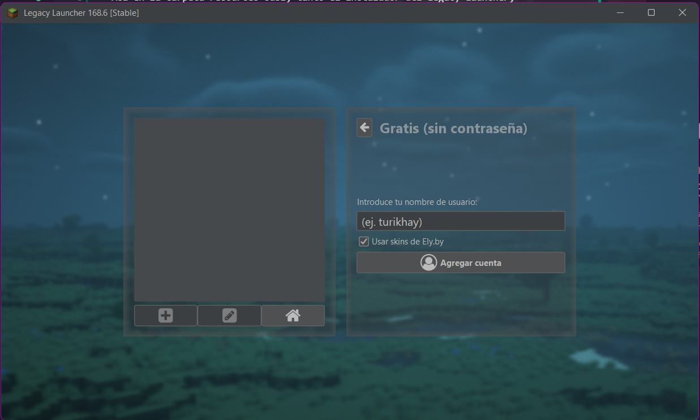

Se ponen su nombre, o el de una cuenta premium (en caso de elegir el nombre de una cuenta premium en servidores se deberia ver la skin de la cuenta premium) y agregan la cuenta

Luego de creada la cuenta ya quedaria seleccionada automaticamente, le dan al icono de la casa para volver al inicio y eligen una version para descargar

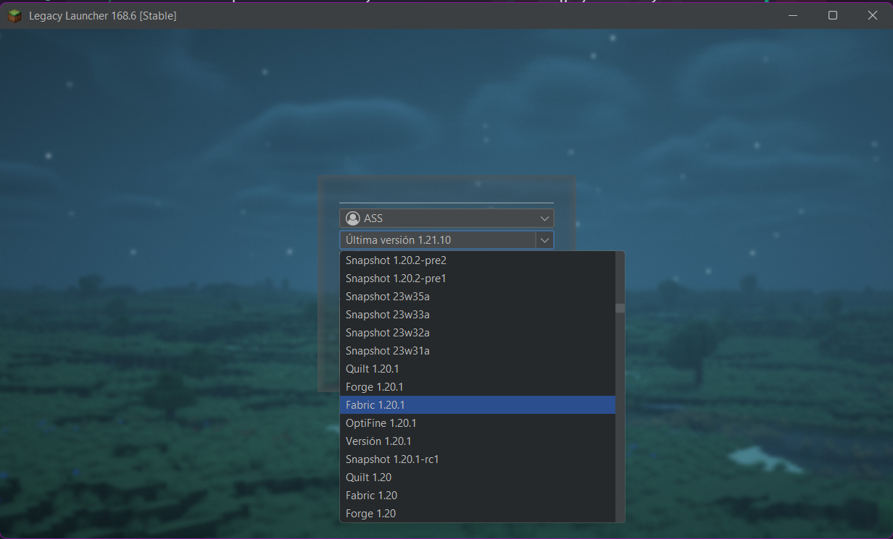

Tienen q bajar hasta q vean Fabric 1.20.1, esa es la version en la q esta creado el servidor y la version con la q corren los mods asi q esa es la version q vamos a usar

Eligen la version y le dan a instalar. Y evidentemente va a tardar

Luego de q descargue ya se abriria por si solo el juego, hay q dejar q haga eso para crear la carpeta de mods q vamos a usar

# En caso de ya tener Launcher de Minecraft pero no tener fabric 

Si ya tienen launcher solo se descargan el fabric q esta aca en el repo

Lo abren  

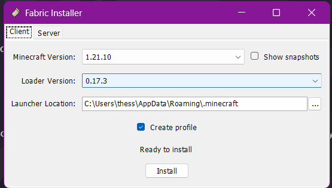

seleccionan la version 1.20.1

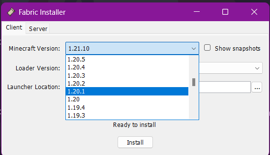

y ya le dan a instalar o a install, lo q les salga primero no c, el fabric tarda como 3 segundos en instalarse, cuando termine les va a abisar en su consola, y ya le pueden dar al boton close

y despues se pasan al minecraft y ya

# Instalacion del pack de mods

En resources aca en este repositorio hay un acceso directo q lleva a la carpeta raiz de minecraft, q es donde se  tienen que descomprimir el comprimido de los mods  

Los mods estan tambien aca en el repositorio en la carpeta mods, y tienen q descargarlos para poder jugar, obviamente

Los descargan, junto al acceso directo, q se llama .minecraft.ink, abren el acceso directo y van a terminar en la raiz de minecraft

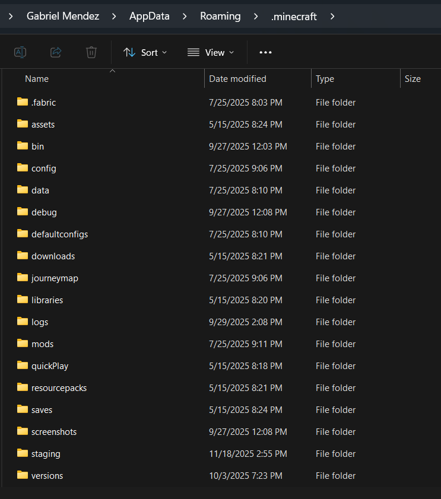

Una vez esten en la raiz, pasan el comprimido de los mods a la raiz

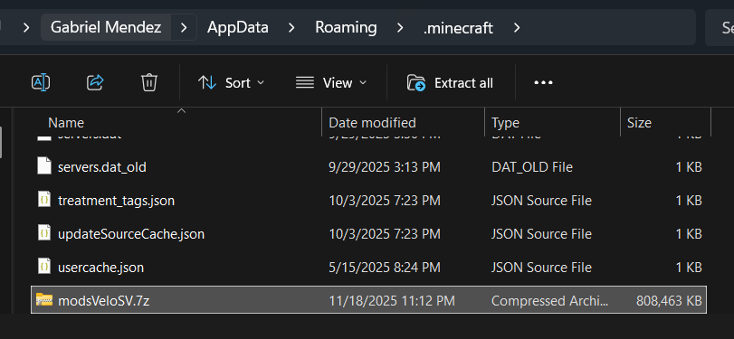

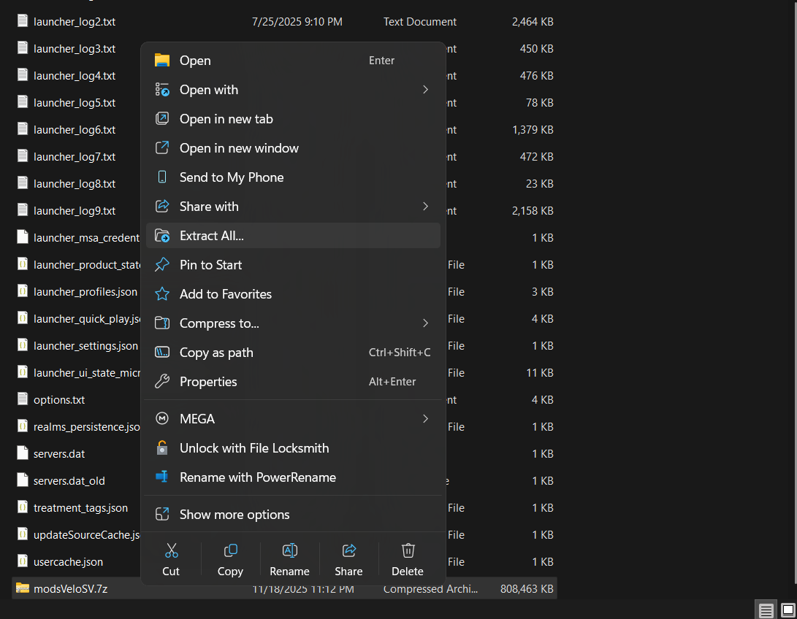

Y lo descomprimen, para hacerlo tienen q darle click derecho y buscar la opcion Extraer todo en el menu, y ya se descomprimiria la carpeta de mods dentro del .7z

Asi ya querarian los mods instalados